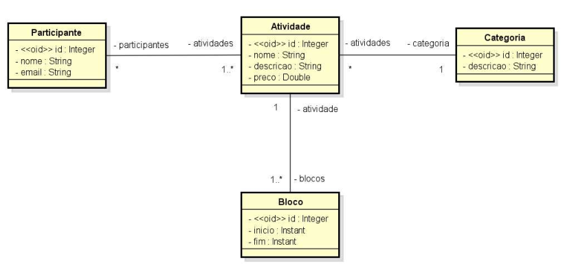
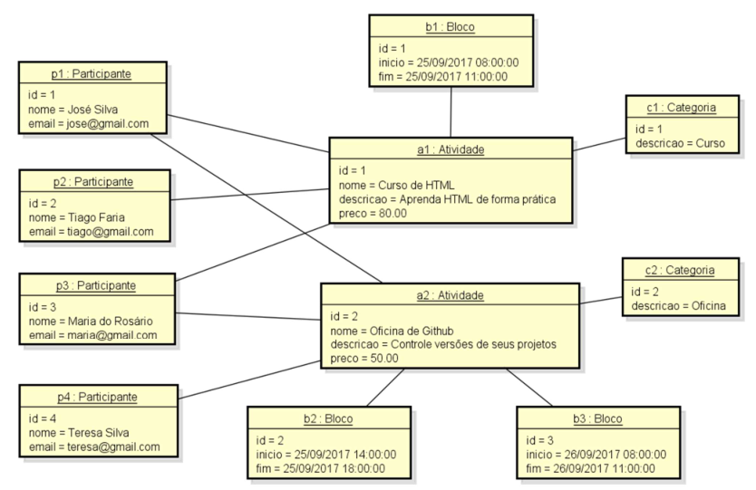
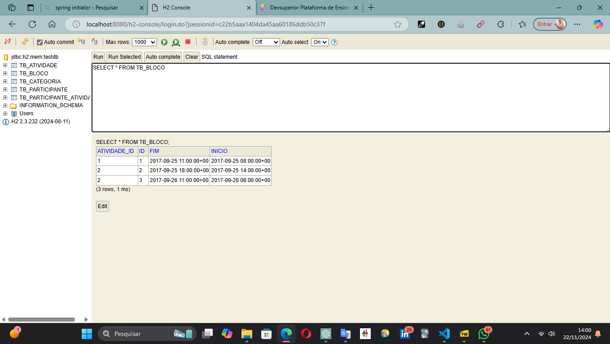

<h1 align="center">DESAFIO: Modelo de domínio e ORM</h1>

[ACESSAR  PROJETO](https://github.com/luizzlcs/dsevent/blob/master/src/main/java/com/antares/dsevent/entities/Atividade.java)

## Funcionalidades

Projeto com Spring Boot com Java e banco de dados H2, e implementando um  modelo conceitual conforme especificação a seguir. Além disso, contém um seeding da base de dados conforme diagrama de objetos que segue.

## ESPECIFICAÇÃO - Sistema EVENTO:
Deseja-se construir um sistema para gerenciar as informações dos participantes das atividades de um evento acadêmico. As atividades deste evento podem ser, por exemplo, palestras, cursos, oficinas práticas, etc. Cada atividade que ocorre possui nome, descrição, preço, e pode ser dividida em vários blocos de horários (por exemplo: um curso de HTML pode ocorrer em dois blocos, sendo necessário armazenar o dia e os horários de início de fim do bloco daquele dia). Para cada participante, deseja-se
cadastrar seu nome e email.

 

Instância dos dados para seeding:

## Tabelas criadas no banco H2

---
### Autor
Sou desenvolvedor fullstack com foco em entregar soluções completas e eficientes, combinando tecnologias modernas como Dart e Flutter para front-end e Java para back-end. Desde 2022, atuo na Ponto Care, onde desenvolvo aplicativos para Android e Web, sempre priorizando inovação, qualidade e a melhor experiência para o usuário.

